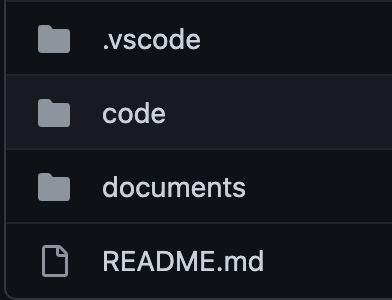
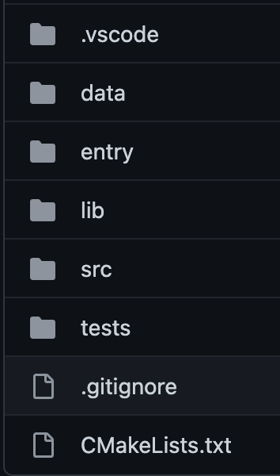

# CAD's CS225 Final Project

<p align="center">
  <a href="#presentation-video">Presentation Video</a> •
  <a href="#data">Data</a> •
  <a href="#repository-structure">Repository Structure</a> •
  <a href="#running-instructions">Running Instructions</a> •
  <a href="#team">Team</a>
</p>

<p align="center">
    
</p>

## [Presentation Video](https://youtu.be/SkTDcgOEYgE)

## Data

We are using the [Bitcoin OTC trust weighted signed network dataset](http://snap.stanford.edu/data/soc-sign-bitcoin-otc.html) data. This dataset contains 5,881 Bitcoin members as node and 35,592 edge with each Bitcoin member ranked on a scale from -10 to +10 classified as our edge weight. This dataset is stored in a CSV file with four columns; Source, Target, Rating, Time. Source is the Bitcoin member rating, Target is the Bitcoin member being rate, Rating is as mentioned the rating for the Bitcoin member on a scale from -10 to +10, and Time is the time of the rating in seconds since Epoch. Our project focuses on the data having a Source, Target, and Rating thus if any data is missing any of those three types of information that line will be ignored. This also implies that the whole column designated to Time can be ignored as such information does not contribute to the goal of our project. 

## Repository Structure

### Deliverables

- All major files that contain our functions and classes are in the [code directory](https://github.com/drod1281/CS225-FinalProject-CAD/tree/main/code). The structure of those files is outlined in [Project Structure](#project-structure).

- Datasets are stored as txt files in [`/data`](https://github.com/drod1281/CS225-FinalProject-CAD/tree/main/code/data) or in ['/data'](https://github.com/drod1281/CS225-FinalProject-CAD/tree/main/code/data).

- Tests are in [`/tests`](https://github.com/drod1281/CS225-FinalProject-CAD/tree/main/code/tests).

- Project report, development log, contract, etc. are in [`/documents`](https://github.com/drod1281/CS225-FinalProject-CAD/tree/main/documents). 

### Project Structure
<p align="center">
  
</p>

<p align="center">
  
</p>

## Running Instructions

You can acquire our files by cloning the [repository](https://github.com/drod1281/CS225-FinalProject-CAD) or downloading the zip files from the [repository](https://github.com/drod1281/CS225-FinalProject-CAD).

Make sure you are running the program in [Docker](https://www.docker.com/). If not, follow [This Guide](https://courses.engr.illinois.edu/cs225/sp2022/resources/own-machine/) to get started.

To build and run our files you will need to use CMake rather than just make. You can first make a new directory in the code directory called build. This directory will be used to build the programs and then move into the directory to run them.

```
mkdir build
cd build
```

Next run CMake as follows.

```
cmake ..
```
This runs CMake to initialize the build directory you created and are currently inside of. You can now run make inside this directory to build the programs in this project.

### Executable


1. BTCGraph(Data Structure): 
    You can use the constructor for this class in two ways. One takes no input and uses our bitcoin dataset and the other takes in your dataset saved as a .csv file.  Through this all other algorithms can be used as this is the main graph data structure used. This class creates and unordered map to store the dataset. 
   
2. makeAverageMap/getAverage (BFS):
   makeAverageMap() is a function of the BTCGraph that used breadth first search traversal to create a new unordered map that stores each bitcoin member rated and their average rating. To acquire this map the getAverage() function can be used through the BTCGraph object you created. 
3. Prim (Prim's Algorithm for Minimum Spanning Tree): 
   Prim was created as its own class which takes in a unordered_map<std::string, std::vector<std::pair<std::string, int>>> graph, a std::vector<std::string> of just the vertices, and a starting point. Both input datasets can be acquired through the BTCGraph object you created using the getGraph() and getKeys() functions. 
   
4. printGraph (Force-Directed Graph Drawing):
   printGraph() is a function of the BTCGraph class which outputs the original data structure as a PNG images with circles represented as circles and line connecting a vertice to all vertices it rated.


### Tests

To run the test cases, run `make test` then `./test` in the build directory.

We constructed several small to medium sized datasets inside the testcases in the [`/tests`](https://github.com/drod1281/CS225-FinalProject-CAD/tree/main/code/tests) directory, which are used as test cases to evaluate if the output of our algorithms are as expected. Our tests focus on testing the functionality of graph construction using BFS, Prim's algorithm, Force Directed Graph Drawing.

## Team
 

- David Rodriguez (`davidr6`)
- Carlos Perez Valencia Romero (`carlosp4`)
- Alexander Romo (`aromo20`)
